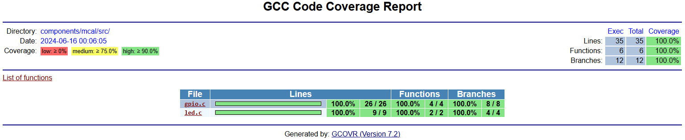

# ceedling-waf

[](https://github.com/richandrysek/ceedling-waf/actions/workflows/build.yml)

[andrysek](https://andrysek.de/)

This demo shows how to use the ceedling together with a waf build framework on a very simple embedded c project.

## System requirements

|SW Component                                                                                                   |Version                |
|---------------------------------------------------------------------------------------------------------------|-----------------------|
|[Ruby](https://developer.hashicorp.com/packer/install?product_intent=packer)                                   | ruby 3.0.4p208        |
|[Ceedling](https://developer.hashicorp.com/vagrant/install?product_intent=vagrant)                             | 0.31.1                |
|[Python3](https://developer.hashicorp.com/vagrant/docs/providers/vmware/vagrant-vmware-utility)                | 3.12.4                |
|[gcc](https://gcc.gnu.org/) - part of Ruby installation                                                        | 11.2.0                |
|[gcovr](https://pypi.org/project/gcovr/)                                                                       | 7.2                   |
|[git](https://git-scm.com/)                                                                                    | 2.45.2                |


## Installation

---
**NOTE**

The ceedling runs with Ruby 3.0, newer versions are not yet ported.

---

## Windows 11

```powershell
winget install Python.Python.3.12
winget install Git.Git
winget install RubyInstallerTeam.RubyWithDevKit.3.0
$env:Path +=';C:\Ruby30-x64\bin\'
$env:PATH +=';C:\Ruby30-x64\msys64\mingw64\bin'
$env:PATH +=';C:\Users\vagrant\AppData\Local\Programs\Python\Python312\Scripts\'
pip install gcovr
gem install ceedling
```

## Quick start

### Get project

```powershell
git clone --recurse-submodules https://github.com/richandrysek/ceedling-waf
# for later updates of subrepositories
# git submodule update --init --recursive -v
cd waf
python ./waf-light configure build
```

### Build and run unit tests

```powershell
python waf/waf configure --ceedling-project-file .\conf\project.yml --ceedling-options "gcov:all utils:gcov"
python waf/waf build ceedling
```

By configuring the waf some ceedling options are used:

* ceedling-project-file - specify where to find a ceedling configuration file
* ceedling-options - specify additional ceedling options; in this case a gcov code coverage reports are enabled

The code coverage report can be found in the path ".\build\ceedling\artifacts\gcov\GcovCoverageResults.html" .



For further details click on a specific c file.

